# **Arkitekturskisse**

Arkitekturskissen gir et visuelt overblikk over hvordan appen er strukturert. Den hjelper både utviklere og andre med å forstå hvilke komponenter som finnes, hvordan de kommuniserer, og hvordan ansvar og funksjonalitet er fordelt i løsningen.
Skissen illustrerer hvordan MVVM-arkitektur er brukt, hvordan data strømmer fra eksterne API-er og lokale filer gjennom lagvise komponenter (DataSource -> Repository -> ViewModel -> UI), og hvordan modularisering er ivaretatt i prosjektet.

### **Diagrammet er nyttig for å illustrere:**

**MVVM-struktur:**
- Den viser en tydelig separasjon mellom UI (Compose-skjermer), ViewModel-lag, Repositories, DataSources, og de faktiske datakildene

**Dataflyt og avhengigheter:**
- Det blir tydelig hvilke komponenter som bruker hvilke andre komponenter, og hvordan informasjon flyter fra API-klienter og lagrede filer opp til UI-en.

**Modularisering:**
- Man ser at ansvarsområder er fordelt mellom spesialiserte komponenter

**Eksterne tjenester:**
- Skissen gjør det klart hvilke tredjepartstjenester som brukes (her har vi Mapbox, MET API, MittFiske API), og hvordan de integreres

# **Klassediagram**

Klassediagrammet er et viktig verktøy i objektorientert modellering, og det gir struktur og oversikt over hvordan datamodellene og logikken i appen henger sammen.

### **Diagrammet er nyttig for å illustrere:**
- Koblingen mellom ViewModels, Repositories, og API-klienter.
- Hva slags data som finnes i f.eks. FishSpot, WeatherData, UserPreferences.
- Hvilke tjenester bruker hvilke modeller.
- Strukturen i forretningslogikk, hva som skjer "under panseret" i FishPredictor for eksempel.

```mermaid
classDiagram
    MapViewModel <-- MapScreen : uses
    MapViewModel --> LocationState : contains
    MapViewModel --> MapViewState : contains

    MapViewModel --> FishSpeciesViewModel : interacts
    FishSpeciesViewModel --> FishSpeciesRepository : uses
    FishSpeciesViewModel --> FishSpeciesData : manages
    FishSpeciesRepository --> FishSpeciesData : provides
    FishSpeciesViewModel <-- FishSelectionScreen : uses

    MapViewModel --> LocationRepository : depends on
    LocationRepository --> LocationsDC : provides
    LocationRepository --> LocationDataSource : uses
    LocationDataSource --> LocationsDC : creates
    LocationDataSource --> MapboxAPIClient : uses

    MapViewModel --> WeatherViewModel : interacts
    WeatherViewModel --> WeatherRepository : uses
    WeatherViewModel --> WeatherData : manages
    WeatherRepository --> WeatherData : provides
    WeatherRepository --> WeatherApiService : uses
    WeatherApiService <|-- WeatherAPIClient : implements

    MapViewModel --> MittFiskeViewModel : interacts
    MittFiskeViewModel --> MittFiskeRepository : uses
    MittFiskeViewModel --> MittFiskeDC : manages
    MittFiskeRepository --> MittFiskeDC : provides
    MittFiskeRepository --> MittFiskeDataSource : uses

    DashboardViewModel --> WeatherViewModel : uses
    DashboardViewModel --> PredictionViewModel : uses
    DashboardViewModel --> MittFiskeRepository : uses
    DashboardViewModel --> DashboardState : contains
    DashboardViewModel --> WeatherData : uses
    DashboardScreen --> DashboardViewModel : uses
    DashboardScreen --> DashboardState : displays

    PredictionViewModel --> FishPredictor : uses
    PredictionViewModel --> PredictionResult : manages
    FishPredictor --> PredictionResult : produces
    FishPredictor --> SpeciesMapper : uses

    class MapViewModel {
        -locationRepository: LocationRepository
        +locationState: StateFlow~LocationState~
        +mapViewState: StateFlow~MapViewState~
        +searchQuery: StateFlow~String~
        +searchResults: StateFlow~List~SearchSuggestion~~
        +isLoading: StateFlow~Boolean~
        +isSearchActive: StateFlow~Boolean~
        +mapCenter: StateFlow~LatLng~
        +zoomLevel: StateFlow~Float~
        +clusters: StateFlow~List~Cluster~~
        +showMinCharsHint: StateFlow~Boolean~
        +onMapEvent(event: MapEvent)
        +updateSearchQuery(query: String)
        +toggleSearchActive(active: Boolean)
        +updateMapCenter(center: LatLng)
        +updateZoomLevel(zoom: Float)
    }

    class MapScreen {
        +MapboxMap
        +SearchBar
        +LocationMarkers
        +ClusteredMarkers
        +FishingSpotDetails
        +LayerToggleButtons
        +ZoomControls
        +HelpDialog
    }

    class FishSpeciesViewModel {
        -fishSpeciesRepository: FishSpeciesRepository
        +fishSpecies: StateFlow~List~FishSpeciesData~~
        +enabledFishSpecies: StateFlow~List~FishSpeciesData~~
        +speciesStates: StateFlow~List~FishSpeciesData~~
        +isLoading: StateFlow~Boolean~
        +toggleSpeciesEnabled(id: String)
        +updateSpeciesOpacity(id: String, opacity: Float)
    }

    class FishSpeciesRepository {
        -context: Context
        +getAllSpecies(): Flow~List~FishSpeciesData~~
        +getEnabledSpecies(): Flow~List~FishSpeciesData~~
        +updateSpeciesEnabled(id: String, enabled: Boolean)
        +updateSpeciesOpacity(id: String, opacity: Float)
        +loadGeoJsonData(): GeoJsonFishData
    }

    class FishSpeciesData {
        +id: String
        +name: String
        +description: String
        +imageUrl: String
        +enabled: Boolean
        +opacity: Float
    }

    class FishSelectionScreen {
        +SpeciesList
        +SpeciesToggleButtons
        +OpacitySliders
        +FilterOptions
        +NavigationButton
    }

    class LocationRepository {
        -locationDataSource: LocationDataSource
        +getAllLocations(): Flow~List~LocationsDC~~
        +searchLocations(query: String): Flow~List~LocationsDC~~
    }

    class LocationDataSource {
        -mapboxApiClient: MapboxAPIClient
        +getLocations(): List~LocationsDC~
        +searchLocations(query: String): List~LocationsDC~
        +NORWAY_CENTER: LatLng
        +COUNTRY_ZOOM: Float
    }

    class LocationsDC {
        +id: String
        +name: String
        +coordinates: LatLng
        +description: String
    }

    class MapboxAPIClient {
        -httpClient: HttpClient
        +getLocationDetails(placeId: String): LocationsDC
        +searchPlaces(query: String): List~LocationsDC~
    }

    class WeatherViewModel {
        -weatherRepository: WeatherRepository
        +weatherData: StateFlow~WeatherData~
        +uiState: StateFlow~WeatherUiState~
        +getWeatherForLocation(lat: Double, lon: Double)
    }

    class WeatherRepository {
        -weatherApiService: WeatherApiService
        +getWeatherForLocation(lat: Double, lon: Double): Flow~WeatherData~
        +getWeather(lat: Double, lon: Double): WeatherResponse
    }

    class WeatherApiService {
        <<interface>>
        +getWeather(latitude: Double, longitude: Double): WeatherResponse
    }

    class WeatherAPIClient {
        -client: HttpClient
        +getWeather(latitude: Double, longitude: Double): WeatherResponse
    }

    class WeatherData {
        +temperature: Float
        +windSpeed: Float
        +precipitation: Float
        +humidity: Float
        +cloudCover: Int
        +pressure: Float
    }

    class MittFiskeViewModel {
        -mittFiskeRepository: MittFiskeRepository
        +uiState: StateFlow~MittFiskeUiState~
        +fishingSpots: StateFlow~List~MittFiskeDC~~
        +selectedSpot: StateFlow~MittFiskeDC?~
        +fetchFishingSpots()
        +selectFishingSpot(id: String)
        +selectSpecies(species: String)
        +getFilteredLocations(): List~MittFiskeLocation~
    }

    class MittFiskeRepository {
        -mittFiskeDataSource: MittFiskeDataSource
        +getFishingSpots(): Flow~List~MittFiskeDC~~
        +getFishingSpotDetails(id: String): Flow~MittFiskeDC~
    }

    class MittFiskeDataSource {
        -httpClient: HttpClient
        +getFishingSpots(): List~MittFiskeDC~
        +getFishingSpotDetails(id: String): MittFiskeDC
    }

    class MittFiskeDC {
        +id: String
        +name: String
        +location: LatLng
        +description: String
    }

    class DashboardViewModel {
        -mittFiskeRepository: MittFiskeRepository
        -weatherViewModel: WeatherViewModel
        -predictionViewModel: PredictionViewModel
        +dashboardState: StateFlow~DashboardState~
        +uiState: StateFlow~WeatherUiState~
        +updateDashboard()
        +getWeatherForLocation(lat: Double, lon: Double)
    }

    class DashboardScreen {
        +WeatherInfoCard
        +PredictionResultsDisplay
        +RecommendedLocationsSection
        +CurrentConditionsSection
        +ForecastChart
    }

    class DashboardState {
        +upcomingTrips: List~FishingTrip~
        +weatherInfo: WeatherData?
        +recommendedLocations: List~LocationWithScore~
        +isLoading: Boolean
    }

    class PredictionViewModel {
        -fishPredictor: FishPredictor
        +predictionResult: StateFlow~PredictionResult~
        +predictFishing(location: LocationsDC, weather: WeatherData, time: Long)
    }

    class FishPredictor {
        -context: Context
        -model: TFLiteModel
        +predict(location: LocationsDC, weather: WeatherData, time: Long): PredictionResult
        +loadModel()
    }

    class SpeciesMapper {
        +mapSpeciesToInputFeature(species: String): Int
        +mapInputFeatureToSpecies(featureIndex: Int): String
    }

    class PredictionResult {
        +fishingScore: Float
        +recommendedSpecies: List~String~
        +bestTimeOfDay: String
    }

    class LocationState {
        +currentLocation: LatLng?
        +searchResults: List~LocationResult~
        +isLoading: Boolean
    }

    class MapViewState {
        +center: LatLng
        +zoom: Float
        +visibleRegion: CoordinateBounds?
    }
```

# **Applikasjonsflyt-diagram**

Diagrammet viser hvilken vei brukeren går gjennom appen, hva som skjer i bakgrunnen av logikk og datainnhenting, og hvilke komponenter og tjenester som er involvert. Det starter ved app-lansering og viser hvordan brukeren navigerer videre, og hvordan data hentes og behandles i lagvise arkitekturkomponenter.

### **Diagrammet er nyttig for å illustrere:**

**Brukerflyt og dataflyt samtidig:**
– Viser både hva brukeren gjør og hvordan appen svarer teknisk, og gir en god samlet illustrasjon av UX og arkitektur

**Forenkle videreutvikling:**
– Utviklere ser tydelig hvordan funksjonalitet er bygd opp, hvor data kommer fra, og hvilke ViewModels og API-er som påvirker hvilke skjermer

**Støtter feilsøking:**
– Man ser fort hvor i flyten noe kan gå galt. F.eks. hvis prediksjonen feiler, kan man følge stien gjennom DashboardViewModel, WeatherViewModel, PredictionViewModel, FishPredictor og TFLite

**Dokumenterer avhengigheter:**
– Det gir en oversikt over hvordan komponenter er koblet sammen, og hvor stramme/løse koblingene er

# **Sekvensdiagram: Førstegangsbruk og kartinteraksjon**

Diagrammet under viser hvordan appen kommuniserer med eksterne tjenester og komponenter når en bruker starter appen første gang, henter kartdata og får fiskeprediksjon. 

### **Diagrammet er nyttig for å illustrere:**

**Brukerflyt og interaksjon:**
- Hvordan en ny bruker blir onboardet og legger inn preferanser
- Hvordan brukerens handlinger trigger kommunikasjon med appen og eksterne systemer

**Systemets samhandling med eksterne API-er:**
- Hvilke tjenester som blir kalt (MET, MapBox, MittFiske, FishBuddy)
- I hvilken rekkefølge disse tjenestene brukes
- Hva slags data som hentes og hvordan det flyter videre i systemet

**Flyt av data og logikk:**
- Hvordan værdata og lokasjon brukes som input til ML-modellen
- Hvordan ulike datakilder kombineres før noe vises til brukeren (f.eks. kart + fiskesteder)

# **Use-case-diagram**

### **Diagrammet er nyttig for å illustrere:**
- Oversikt over brukerkrav, "hva skal systemet kunne gjøre?"
- Kommuniserer funksjonell arkitektur på et ikke-teknisk nivå, lett å forstå for utviklere, designere og interessenter
- Avdekker mangler eller overflødig funksjonalitet tidlig i utviklingen
- Støtter videre modellering (sekvensdiagrammer, tester, arkitektur)
- Binder sammen brukeropplevelse og systemdesign

Diagrammet viser hvilke handlinger brukeren kan gjøre relatert til MapScreen i appen. Det inkluderer både hovedfunksjoner og tilknyttede systemprosesser, som å hente kartdata fra MapBox eller fiskedata fra Fishbuddy.

Diagrammet viser hvilke handlinger brukeren kan gjøre relatert til DashboardScreen i appen. Dette inkluderer både hovedfunksjoner og tilknyttede systemprosesser, som å hente værdata fra Meteorologisk Institutt eller at ML-modellen kjører lokalt.

